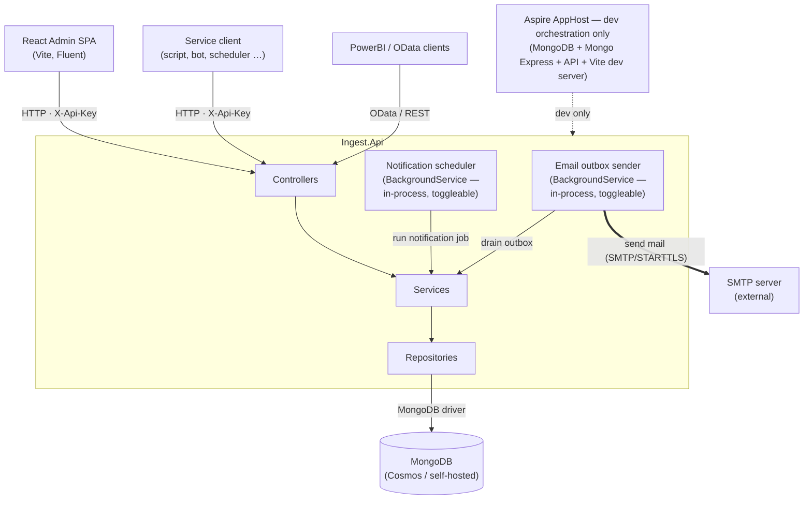
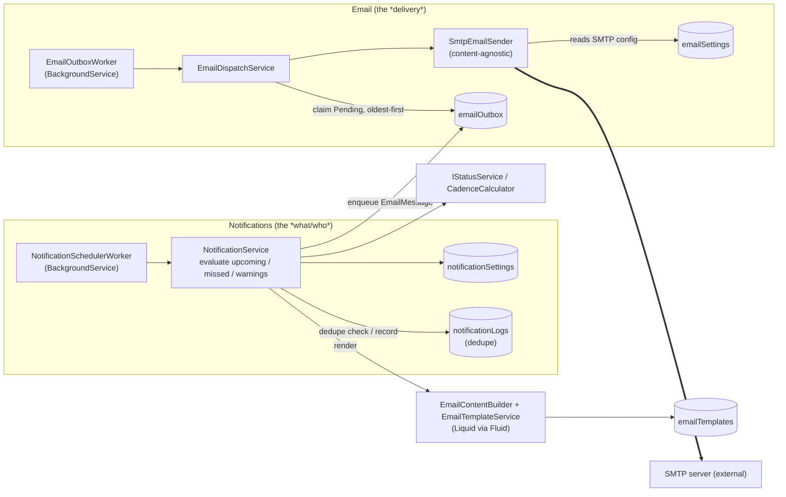

# Architecture

This document explains how Ingest is put together, what each piece is responsible for, and how a request flows through the system. Read this first if you plan to extend the service or just want to understand "why is _that_ in _there_".

## What it is

Ingest is a small data-ingestion backend for KPI (or survey) submissions from services, teams, or partners. Submitters authenticate with an API key and POST samples; administrators manage the catalogue of accepted schemas, accounts, and submissions through a React/Fluent UI admin SPA. The same backend exposes an OData feed so PowerBI (and any other generic OData consumer) can read the data directly.

Ingest is a single-tenant application with one clear job: collect samples from reporting units, validate them against a schema catalogue, and serve them to reporting tools through a stable read model. The design favours a small, extensible foundation with a well-defined scope over a multi-tenant SaaS.

## Birds-eye view



The two background services run **in-process** inside `Ingest.Api` by default and can be turned off (so an external scheduler drives the same work through internal endpoints) — see [§ Email & notifications](#email--notifications). In production the Docker image bundles the compiled API and the built SPA; Aspire is dev-only.

## Solution layout

```
src/
  Ingest.AppHost/         Aspire orchestrator (Mongo + API + admin SPA). Local dev only.
  Ingest.ServiceDefaults/ OpenTelemetry, health checks, resilience defaults.
  Ingest.Api/             ASP.NET Core host: controllers, auth, OData, SPA hosting, background workers.
  Ingest.Core/            Pure domain model + abstractions. No I/O, no framework code.
  Ingest.Infrastructure/  Concrete implementations: Mongo repos, hashing, NCalc, services, Email/ (SMTP, outbox, templates, notifications).
web/admin/                React + Vite + Fluent UI admin SPA.
tests/Ingest.Tests/       Test suite.
Dockerfile                Multi-stage build: SPA + API into one image.
```

The split is deliberately Clean-Architecture-ish: `Core` knows nothing about Mongo or HTTP; `Infrastructure` depends on `Core` and never the other way round; `Api` depends on both.

### Why a separate `Core` project?

Two reasons:

1. It makes the domain model testable without spinning up a Mongo container.
2. The unit tests reference `Ingest.Core` only — there's never a temptation to "just call the repo from a test".

## The domain model

### Account

Represents anyone (or anything) authenticated by Ingest.

| Field | Meaning |
|-------|---------|
| `Name` | Stable machine-style identifier (e.g. `roads-team`). Unique across all accounts, including soft-deleted ones. |
| `Label` | Friendly name displayed in the UI (e.g. "Roads & Highways team"). |
| `Description` | Free-form notes. |
| `Kind` | `User` (interactive — can log in to the UI) or `Application` (API-only). |
| `Role` | `Service`, `Operator`, `Approver` or `Admin` — a template that seeds the account's capabilities. See [authentication.md](authentication.md). |
| `Capabilities` | Per-account override set of fine-grained capabilities. Empty means "follow the role default bundle". See [authentication.md § Authorisation: capabilities](authentication.md#authorisation-capabilities). |
| `Email` | Optional contact address. Recipient for ad-hoc emails and the target of "notify the service account" notification rules. Required at *create* time in the UI; pre-existing accounts may have it empty. |
| `Enabled` | When false, every API key for this account is invalid. |

Kind and Role are orthogonal: a `User` can hold any role; an `Application` can hold any role. The UI rejects `Application`-kind logins at the boundary.

### ApiKey

Many-to-one with `Account`. Stores only the **hash** and **salt**, never the plaintext. Each row carries a public `KeyId` (the prefix the client sends before the dot) so authentication can locate the right hash with a single index lookup. See [authentication.md](authentication.md) for the full lifecycle.

### Schema (+ SchemaValue)

A **schema** is a package of related KPI values that a service reports together (think "monthly waste collection report"). A **schema value** is a single KPI inside that package (think "tonnes collected").

```
Schema
├─ Name, Label, Description, Notes
├─ Modifiable, Enabled          ← package-level gates
├─ IsGlobal, ServiceIds         ← audience (global, or restricted to listed accounts)
├─ SubmissionValidations[]      ← NCalc expressions that see ALL values at once
└─ Values[]
   └─ SchemaValue
      ├─ Name, Label, Description, Notes
      ├─ Type (String/Integer/Number/Date/Boolean)
      ├─ Unit
      ├─ Cadence (Daily/Weekly/Fortnightly/Monthly/Quarterly/SemiAnnually/Yearly)
      ├─ Required, Modifiable, Enabled  ← per-value gates
      ├─ Min/Max, MinDate/MaxDate, MinLength/MaxLength, RegexPattern
      ├─ ValueValidation              ← NCalc expression that sees this value
      ├─ Warning                       ← optional non-blocking notice
      └─ EnabledIf, VisibleIf          ← optional conditional-display rules
```

Each value has its **own** cadence: a monthly schema can contain weekly KPIs perfectly fine. The cadence is what the validator uses to enforce "only one submission per period" rules and what `me/status` rolls up against.

### Submission

A submission is the unit of writes: an account sends a batch of `Sample` rows in one request, all referring to the same schema. Submissions are immutable past their cadence window for Service-role callers; Admins can replace them retroactively.

### SampleProjection

A denormalised, one-document-per-sample read model rebuilt on every submission save. It's what the OData feed (`/odata/samples`) and the admin query endpoint (`/api/admin/query`) actually read — submissions themselves are never touched by reporting workloads, so the schema for analysis can evolve independently of the schema for ingestion.

### Email & notification entities

These back the email/notification subsystem (see [§ Email & notifications](#email--notifications) for how they fit together):

| Entity | Collection | Role |
|--------|------------|------|
| `EmailMessage` | `emailOutbox` | A queued message + its delivery state (`Pending` → `Sending` → `Sent`/`Failed`), attempt count and last error. The durable outbox. |
| `EmailSettings` | `emailSettings` | The single SMTP connection document (host, port, STARTTLS, username, from). The password is stored **encrypted at rest**. |
| `EmailTemplate` | `emailTemplates` | A named (`Key`) Liquid template: subject + text body + optional HTML body. |
| `NotificationSettings` | `notificationSettings` | The single config document: per-trigger rules (enabled, lead time) and recipient choices. |
| `NotificationLog` | `notificationLogs` | One row per already-sent notification (unique `Key`), used to deduplicate so an event notifies at most once. |

## Request flow

A typical `POST /api/submissions` walks through these layers, in this order:

1. **Authentication handler** (`ApiKeyAuthenticationHandler`) reads `X-Api-Key`, splits it into `KeyId` and `Secret`, looks up the key row, verifies the HMAC, loads the account, then emits a `ClaimsPrincipal` with `accountId`, `name`, `label`, `kind`, `role`, and one `ingest:cap` claim per effective capability.

2. **Authorization policy** (one per capability, named after the capability itself, e.g. `submissions:read`) gates the controller action by checking the principal carries the matching capability claim. The self-service endpoints use the bare authenticated `Service` policy instead.

3. **Controller** (`SubmissionsController`) does parameter binding and DTO mapping. No business logic.

4. **Service** (`SubmissionService`) is where everything interesting happens:
   - Resolve the schema by name (using the visibility filter — the caller can't submit to a schema it isn't assigned to).
   - Hand the assembled `Submission` to `ISubmissionValidator`.
   - Persist via `ISubmissionRepository`.
   - Rebuild the `SampleProjection` rows for that submission so the OData feed sees the new data immediately.
   - For replacements only: check the cadence window is still open before letting a Service-role caller through.

5. **Repository** (`SubmissionRepository`, etc.) is a thin Mongo wrapper. It applies the soft-delete filter, deals with paging, and that's about it.

6. **Exception handler** (`ProblemDetailsExceptionHandler`) maps domain exceptions to HTTP status codes:
   - `NotFoundException` → 404
   - `ConflictException` → 409 (e.g. duplicate name)
   - `ForbiddenException` → 403 (e.g. cadence window closed)
   - `ValidationException` → 400 with `errors[]` extension
   - everything else → 500

The split keeps controllers tiny, the service layer easy to unit-test, and the repositories unaware of any business rule.

## Validation

Validation runs inside `SubmissionValidator` and is layered:

1. **Visibility / enabled-state** — schema must be visible to the calling account and not disabled.
2. **Conditional display** — for every sample, `SchemaValue.EnabledIf` and `VisibleIf` are evaluated against the whole submission context. Samples whose rule is false are *discarded* (not persisted) and a warning is added to the response. Subsequent passes ignore discarded samples.
3. **Shape** — type matches; min/max, regex, length constraints honoured.
4. **Per-value NCalc rule** — `SchemaValue.ValueValidation` runs once per surviving sample with `value`, `minimum`, `maximum` in scope.
5. **Warning rules** — `SchemaValue.Warning` runs per surviving sample; a truthy result contributes to the response warnings (non-blocking).
6. **Cadence** — Mongo lookup against `SampleProjection` to ensure no other sample exists for the same `(service, schema, value)` inside the current cadence bucket. On replacement, the submission being replaced is excluded.
7. **Modifiability** — Service-role callers can only change a sample whose value is `Modifiable`.
8. **Schema-level NCalc rules** — `Schema.SubmissionValidations` runs once per schema present in the payload, with every value of the schema exposed as a variable (or `null` if the sample is absent or was discarded).
9. **Required values** — on create, every required value of every schema the submission carries samples for must be present. Schemas the service is assigned to but didn't include in this submission are not checked (a service with N visible schemas can still send one schema at a time). Values whose conditional rule is false are exempt.

Validators may return either a boolean or a string. A non-empty string is treated as an error message and surfaced verbatim, so authors can write nice user-facing messages without code changes. See [../admin-user-guide/validation.md](../admin-user-guide/validation.md) for the admin-facing rule-authoring guide.

### Live feedback in the admin UI

The submission editor previews `EnabledIf` / `VisibleIf` / `Warning` rules as the user types so fields appear, disable themselves, or surface warnings without a round-trip per keystroke. Rather than ship a second parser to the browser, the API exposes an unauthenticated `POST /api/expressions/translate` endpoint backed by `IExpressionTranslator` (implementation: `NCalcToJavaScriptTranslator`). It walks the NCalc AST with `ILogicalExpressionVisitor<string>` and emits a single JavaScript expression that the SPA wraps in `new Function("V", "H", ...)`. The runtime helpers (`H`) live in `web/admin/src/utils/expression.ts` and implement the same null-handling and built-in functions the server-side evaluator uses, so what the user sees in the editor matches what they'd get if they posted the submission.

The target language is selected through standard HTTP content negotiation. The SPA sends `Accept: text/javascript`; the server matches it (or `application/javascript`, `*/*`, `application/*`, `text/*`) and returns the translated expression in the requested media type. Any other Accept value gets a `406 Not Acceptable`. The shape leaves room for additional targets — a future `text/plain` is reserved for a human-readable explanation of the rule — without changing the route or the request body.

Translations are deterministic functions of the source string, so the client caches them by source for the lifetime of the page; each unique rule is translated exactly once. Server-side validation remains authoritative — if translation fails or a rule references something the runtime can't resolve, the editor stays permissive (show + no warning) and the real verdict comes back with the submission response.

The submission form and its rule machinery are factored into shared pieces — `SchemaSampleFields` (the controlled form renderer) and `utils/sampleRules.ts` (the row model, the variable context the server mirrors, gating, and the `useSampleRules` prefetch hook) — so the same translate runtime also powers the **schema editor's Preview** (`SchemaPreviewDialog`). The preview renders the live form from the in-progress, unsaved schema and additionally evaluates value-level and schema-level validations client-side (via `interpretRuleResult`, mirroring the server's accept/reject contract). It's explicitly best-effort: the dialog carries a disclaimer that the server is authoritative, since the regex dialect and submission-only helpers (`sampleTimestamp()`, `serviceName()`) differ in the browser.

## Cadence semantics

`CadenceCalculator.BucketFor(cadence, timestamp, anchors)` returns the half-open `[start, end)` window that contains `timestamp` for the given cadence. With the default anchors (plain calendar) the buckets are:

| Cadence       | Bucket                                                                                                                                                                                                                |
|---------------|-----------------------------------------------------------------------------------------------------------------------------------------------------------------------------------------------------------------------|
| Daily         | 00:00:00 of the day → 00:00:00 of the next day (UTC). Never anchored — always midnight UTC.                                                                                                                          |
| Weekly        | ISO-style Monday-anchored week.                                                                                                                                                                                       |
| Fortnightly   | 14-day window, Monday-anchored. Aligned to a fixed reference Monday (2001-01-01) so consecutive fortnights never overlap and every service sees the same biweek boundaries regardless of when the schema was created. |
| Monthly       | First of the month 00:00 → first of next month 00:00.                                                                                                                                                                 |
| Quarterly     | Calendar quarter: Q1 = Jan–Mar, Q2 = Apr–Jun, Q3 = Jul–Sep, Q4 = Oct–Dec.                                                                                                                                             |
| SemiAnnually  | Calendar half-year: H1 = Jan–Jun, H2 = Jul–Dec.                                                                                                                                                                       |
| Yearly        | January 1st 00:00 → next January 1st 00:00.                                                                                                                                                                           |

These alignments are **configurable** from Settings → Submission periods (`AppConfiguration.FiscalYearStartMonth` / `WeekStartDay` / `MonthStartDay` / `FortnightAnchor`, surfaced through `IAppConfigurationService.GetCadenceAnchorsAsync`), resolved to a `CadenceAnchors` record. Weekly follows a configurable week-start day, Monthly a configurable start-of-month day, Fortnightly a configurable anchor date, and Quarterly/SemiAnnually/Yearly all derive from a single configurable fiscal-year-start month (they're just different-sized sub-periods of the same fiscal year). `CadenceAnchors.Default` reproduces the table above exactly, so a deployment with no configuration — or any code path that calls `BucketFor` without passing anchors — behaves exactly as it always did. Anchors apply going forward only: changing one doesn't retroactively re-bucket `SampleProjection` rows already written under the old alignment.

The validator uses this for cadence checks; the status service uses it for "satisfied this period?" computations; the history endpoint uses it for chart buckets; the explore/scorecard service uses it for period comparisons. All of these fetch the current anchors once per request via `IAppConfigurationService` and thread them through.

## Submission windows

A cadence's **bucket** (above) is its period's identity — used for dedup/history/"which period is this sample in" — but it is *not* automatically the deadline for acting on that period. `CadenceCalculator.WindowFor(cadence, timestamp, anchors, windows)` layers a separate, per-cadence **submission window** on top of the bucket: `[bucket.Start + OpenOffsetHours, bucket.End + GraceHours)`. `CadenceWindow(OpenOffsetHours, GraceHours)` and the `CadenceWindows` record holding one per cadence are configured the same way as anchors — `AppConfiguration.CadenceWindows` (a `CadenceWindowSettings` of nullable `CadenceWindowOverride`s), surfaced through `IAppConfigurationService.GetCadenceWindowsAsync`/`UpdateCadenceWindowsAsync` and Settings → Submission periods. `CadenceWindows.Default` gives every cadence `CadenceWindow.None` (zero offset, zero grace), so the window is exactly the bucket until an admin configures otherwise — a deployment with no configuration, or any caller that omits `windows`, behaves exactly as it did before this feature existed.

This backs three behaviours:

- **Create is gated, not just replace.** `SubmissionService.CreateMineAsync`/`ValidateMineAsync` reject (via `ForbiddenException`, HTTP 403) any incoming sample whose timestamp's window doesn't contain "now" — either "doesn't open until…" (before `OpenOffsetHours` has elapsed since the bucket started) or "closed on…" (past `GraceHours` after the bucket ended). With all-zero windows this simply means a service can only ever create a submission for the cadence's *current* bucket — a real behavior change from the pre-feature state where create had no time gate at all, but a no-op until an admin actually configures a non-zero offset/grace. **Drafts are exempt** from this check (mirroring the pre-existing replace exemption — nothing is live yet), and **admin create/replace remain fully bypassed** (the deliberate remediation path for backdating or fixing a submission after its window has closed).
- **Replace's deadline is grace-extended.** `SubmissionService.ClosedCadenceError` (the existing replace-path lock) now compares `WindowFor(...).End` instead of the raw bucket end, so a configured grace genuinely buys extra edit time on an already-existing submission.
- **"Missed" waits for grace; "upcoming" reminds against the real deadline.** `StatusService.GetMissingAsync` withholds a `Previous`-tier bucket entirely until its window (bucket end + grace) has actually closed — so grace delays both the "missed" status column and (since `NotificationService.RunMissedAsync` just consumes that report) the missed-submission email. `GetMissingHistoryAsync` (the explicit historical-by-offset audit view used by the Missing Submissions trend chart) is deliberately left alone — it's "what happened", not a live deadline signal. `NotificationService.RunUpcomingAsync` measures its lead-time comparison against the grace-extended end instead of the raw bucket end, so a reminder doesn't fire (or a value doesn't drop off the "upcoming" list) before the real deadline.

`GET /api/admin/configuration/cadence-preview` computes, for all 7 cadences at "now", both the bucket and the window using the exact same `CadenceCalculator` math the enforcement paths use — it's what backs the read-only "Current periods" table on the Settings page, so there's one server-side source of truth for "when does this cadence actually open and close" rather than a client-side reimplementation of the anchor/window arithmetic.

## Ingestion kill switch

`AppConfiguration.SubmissionsClosed` (+ optional `SubmissionsClosedMessage`) is a global, database-backed "close all submissions" switch for disaster recovery — see [setup/disaster-recovery.md](../setup/disaster-recovery.md#scenario-1--accidental-data-deletion-or-bad-bulk-write) and [admin-user-guide/settings.md](../admin-user-guide/settings.md#ingestion). It is checked (via `IAppConfigurationService.GetIngestionStatusAsync`) at exactly the *service-facing* ingestion entry points — `SubmissionService.CreateMineAsync`/`ReplaceMineAsync`, `BulkImportService.ImportAsync`, and the Teams inbound invoke handler — which throw/return a `ServiceUnavailableException` (mapped to HTTP 503) carrying the configured message. Admin-facing writes (`AdminCreateAsync`/`AdminReplaceAsync`, used by both the admin UI and — deliberately — by bulk import and Teams under the hood) are **not** gated, since remediation must stay possible while the switch is on; every read path (submissions, OData, schemas, settings, `/me`) is unaffected. `GET /api/me` exposes the current state to every signed-in account (not just `settings:read` holders) so the admin SPA can render a site-wide warning banner regardless of role.

## Aspire (`Ingest.AppHost`)

The AppHost is the dev-time orchestrator only. It declares:

- A MongoDB container (`AddMongoDB`), with a named data volume so data survives restarts.
- Mongo Express alongside, for quick database inspection.
- The API project, with a reference to the Mongo database (Aspire wires the connection string).
- The Vite dev server (`AddNpmApp`) with the API endpoint passed in via `VITE_API_URL`.

In production, the Docker image bundles the compiled API and the built SPA into a single container — Aspire isn't in the picture.

## Configuration

Configuration is pure ASP.NET Core: `appsettings.json`, environment variables, user-secrets. Mapped to strongly-typed options:

| Section     | Type             | Source file                              |
|-------------|------------------|------------------------------------------|
| `Mongo`     | `MongoOptions`   | `Ingest.Infrastructure/Mongo/MongoOptions.cs` |
| `ApiKey`    | `ApiKeyOptions`  | `Ingest.Infrastructure/Security/ApiKeyOptions.cs` |
| `Ingest`    | `IngestOptions`  | `Ingest.Api/Options/IngestOptions.cs`    |
| `Email`     | `EmailOptions`   | `Ingest.Infrastructure/Email/EmailOptions.cs` |
| `Notifications` | `NotificationOptions` | `Ingest.Infrastructure/Email/NotificationOptions.cs` |

See [../setup/configuration.md](../setup/configuration.md) for the full table of keys and defaults.

## Mongo indexes

Indexes are ensured on startup by `MongoSetup.EnsureIndexesAsync`:

| Collection    | Index                                                                    | Purpose |
|---------------|--------------------------------------------------------------------------|---------|
| `accounts`    | `uniq_name` on `Name` (unique)<br/>`by_external_login` on `(externalLogins.provider, externalLogins.email)` (sparse) | Name uniqueness + fast lookup; SSO identity lookup. |
| `apiKeys`     | `uniq_keyId` on `KeyId` (unique), `by_account` on `AccountId`            | Auth lookup, admin listing. |
| `schemas`     | `uniq_name` on `Name` (unique)                                           | Name uniqueness + fast lookup. |
| `submissions` | `by_service_time` on `(ServiceAccountId, SubmittedAt desc)`              | Per-service listing. |
| `samples`     | `by_service_schema_value_time` on `(ServiceAccountId, SchemaName, ValueName, Timestamp desc)`<br/>`by_service_schema_value_period` on `(…, PeriodStart)`<br/>`by_submission` on `SubmissionId` | Status queries, history aggregation, cascade-delete on submission removal. |
| `reports`     | `uniq_name` on `Name` (unique)                                           | Name uniqueness + fast lookup for the report viewer. |
| `auditLogs`   | `by_timestamp` on `Timestamp desc`<br/>`by_target_time` on `(TargetId, Timestamp desc)`<br/>`by_type_change_time` on `(TargetType, Change, Timestamp desc)` | Audit browse, per-object history, type/change filters. |
| `emailOutbox` | `by_status_created` on `(Status, CreatedAt)`<br/>`by_created` on `CreatedAt desc` | Drain pending oldest-first; "Sent emails" browse newest-first. |
| `emailTemplates` | `uniq_key` on `Key` (unique)                                          | One template per key. |
| `notificationLogs` | `uniq_key` on `Key` (unique)                                       | Dedupe: at most one row (and one send) per event. |
| `events`      | `by_timestamp` on `Timestamp desc`                                       | Timeline browse, newest first. |
| `commentThreads` | `by_target_resolved` on `(TargetType, TargetId, Resolved)`            | List every thread for a target; aggregate open-thread counts across many targets. |

## Reports

`Report` documents are HTML+Liquid templates uploaded by admins and stored verbatim alongside their parsed YAML front-matter metadata (`Name`, `Label`, `Description`, `Type`, `TargetSchemaNames`). Rendering is server-side via [Fluid](https://github.com/sebastienros/fluid) running with an `UnsafeMemberAccessStrategy` so templates can reach into the curated data envelope (schema, services, value buckets, samples) without per-type registration. The envelope shape depends on `ReportType`: `Single` carries one submission and the owning schema/service; `Aggregate` carries the per-value bucketed history of a schema over a date range. Render output is dropped into a `sandbox=""` iframe in the SPA so any script/style hostility in the template is neutralised. See [admin-user-guide/reports.md](../admin-user-guide/reports.md) for the author-facing reference.

## Explore (in-app analytics)

`ExploreService` powers the operator-facing **Explore** page (`GET /api/admin/explore/series`). It loads the live sample projections for one schema — narrowed by value name, service and timestamp window through `ISampleRepository.GetForExploreAsync` (a bounded `Find`, capped well above the reference volume) — and folds them in memory into per-cadence buckets, each carrying an overall reduction and a per-service breakdown for the requested aggregation (Average/Sum/Min/Max/Count). Because period boundaries are pre-computed at submission time, samples from different services in the same window collapse onto the same bucket for free. It's a deliberately small convenience over the projection (Trend/Compare/Snapshot charts), not a BI engine — serious analysis still belongs in Power BI against the OData feed. See [admin-user-guide/explore.md](../admin-user-guide/explore.md).

The Trend chart also overlays the `Event` timeline (`GET /api/admin/events`, gated by `events:read`) as vertical reference lines (point-in-time / open-ended) or shaded reference areas (interval), mapped client-side onto the same cadence buckets the series already uses. `EventsService` and the `events` collection are otherwise unrelated to the submission pipeline — events are a purely informational annotation, never validated against or aggregated with sample data. The same timeline is published for BI tools as the `events` OData feed (`EventFeedItem`, computing an `EffectiveEnd` so a client can query by open/closed interval without knowing each kind's duration rule) — see [setup/powerbi/events.md](../setup/powerbi/events.md).

## Comments

`CommentThread` (in the `commentThreads` collection) is a small threaded-discussion aggregate attached to a schema — either the schema as a whole or one of its values (`ValueName`) — with its `Comment` replies embedded directly in the thread document rather than in a separate collection: threads and comments are always read/written together and volumes are admin-curated (like `Event`), so a join buys nothing. `CommentsService` mirrors `EventsService`'s shape (soft-delete + `IAuditContext` stamping + `IAuditLogService.RecordAsync`), injecting `ISchemaService` only to validate that a thread's target (and optional value name) actually exists.

Three capabilities gate the feature — `comments:read`, `comments:create`, `comments:manage` — none of which are in any role's default bundle, so only `AccountRole.Admin` has them until explicitly granted. `comments:manage` covers editing/deleting *any* comment and resolving/deleting a thread; `comments:create` alone additionally lets the comment's own author (`Comment.CreatedByAccountId`) edit its text — a data-dependent rule that can't be a single declarative `[Authorize(Policy=...)]`, so `AdminCommentsController.EditComment` reads both capability claims off the caller and passes `callerCanManageAny`/`callerAccountId` into the service for the ownership check. Resolving a thread (`CommentThread.Resolved`) locks it against new comments — `AddCommentAsync` throws `ConflictException` (mapped to 409) until a `comments:manage` holder reopens it — and is itself audited as an `Edit`, not a separate change type. `GET /api/admin/comments/open-counts` aggregates open (unresolved, non-deleted) thread counts across a batch of target ids in one Mongo `Aggregate`/`Group` call, powering the schemas list's per-schema open-thread badge without an N+1 query per row.

## Email & notifications

The subsystem is split into two deliberately decoupled halves so the *delivery* mechanism and the *decision* logic can evolve (or be swapped/extracted) independently. The whole subsystem is gated by `Email:Enabled` (default on) — when off, the services, workers, controllers' effects, and the related SPA surfaces all stand down.



**Email (delivery) knows nothing about content.** `IEmailQueue` enqueues an `EmailMessage` (already-rendered subject/body + recipients) into `emailOutbox`. `EmailDispatchService` claims `Pending` messages oldest-first and hands each to `SmtpEmailSender`, which reads the SMTP connection from `emailSettings` and sends it. Delivery state, attempt count and the last error are written back to the message; if SMTP isn't configured the message is marked `Failed` with a clear reason rather than lost. The SMTP password is encrypted at rest by `IEmailSecretProtector` (AES-GCM with a key derived from `ApiKey:Pepper`), so a database dump never exposes it.

**Notifications (logic) build on top.** `NotificationService` reads the admin-authored `notificationSettings` (which triggers are on, lead times, recipients), evaluates the three triggers against current state (`IStatusService` / `CadenceCalculator` for upcoming & missed; persisted submission `Warnings` for the warnings trigger), renders the relevant `emailTemplates` entry via `EmailContentBuilder` (the same Fluid engine the reports use), resolves recipients (the service account's `Email` and/or the operator/admin recipient list), and **enqueues** the result. Every event has a stable dedup `Key` recorded in `notificationLogs`, so re-running the job never double-sends.

**Scheduling is a thin, replaceable trigger.** `EmailOutboxWorker` and `NotificationSchedulerWorker` are in-process `BackgroundService`s that simply call `EmailDispatchService.DrainAsync` / `NotificationService.RunAsync` on a timer. Both are independently toggleable (`Email:Worker:Enabled`, `Notifications:Scheduler:Enabled`); turning a worker off and POSTing to the matching internal admin endpoint (`/api/admin/email/drain`, `/api/admin/notifications/run`) lets an external scheduler — or, later, a dedicated service — drive exactly the same code path. This is the seam for promoting either half out of the monolith without touching the domain logic.

See [../setup/configuration.md § Email & notifications](../setup/configuration.md#email--notifications) for the config keys and [../admin-user-guide/settings.md](../admin-user-guide/settings.md) for the operator-facing UI.

## Testing

The test project (`tests/Ingest.Tests`) focuses on the core domain logic:

- API-key hashing roundtrip.
- NCalc evaluator semantics (boolean, string-message, null-safe).
- NCalc → JavaScript translation (short-circuit, identifiers, function calls).
- Cadence bucketing.
- The submission service end-to-end with an in-memory fake repository.
- Email secret encryption round-trip (`EmailSecretProtector`) and Liquid email rendering (`EmailContentBuilder`).

## Further reading

- [authentication.md](authentication.md) — how API keys work end-to-end.
- [../client/api.md](../client/api.md) — full reference for the service-facing API surface.
- [../admin-user-guide/README.md](../admin-user-guide/README.md) — how to operate the system from the admin SPA.
- [../admin-user-guide/validation.md](../admin-user-guide/validation.md) — writing validation rules at sample and schema level.
- [../setup/hosting.md](../setup/hosting.md) — deploying to Azure.
- [../setup/powerbi/](../setup/powerbi/README.md) — connecting reporting tools.
