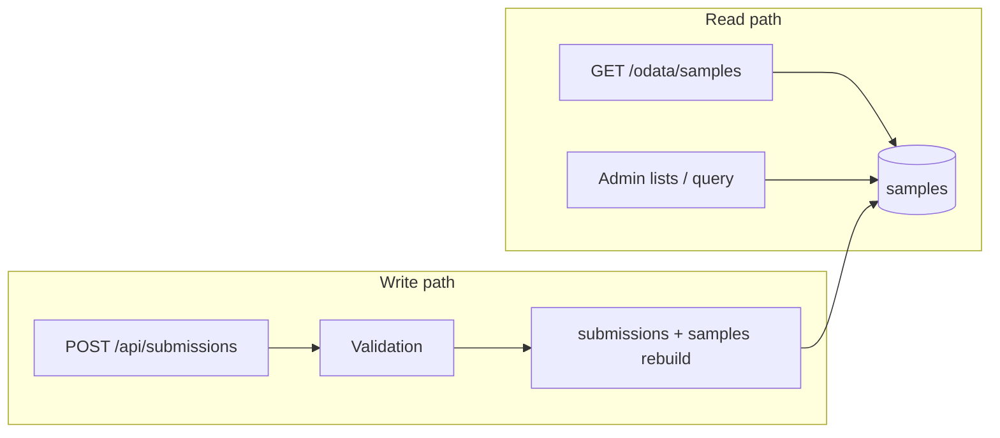

# Performance & capacity

This page describes the **expected workload and response times** for a typical council KPI deployment on the [standard Azure hosting setup](hosting.md) (Azure Container Apps at 0.5 vCPU / 1 GiB with min 1 replica, backed by Cosmos DB for MongoDB vCore on the **M30** tier). The figures are order-of-magnitude forecasts — useful for sizing, SLA conversations, and setting expectations — not the result of a formal load test.

Ingest is deliberately small: one container, one database, no horizontal sharding. At the scale described below the standard Azure footprint is **comfortably oversized**; bottlenecks show up as occasional slow admin pages or long Power BI refreshes, not as sustained throughput limits.

## Reference deployment profile

The forecasts assume a registry that looks like a mid-sized local council after a couple of years of operation:

| Dimension | Typical value |
|-----------|---------------|
| Service accounts (API submitters) | 25–35 |
| Schemas in the catalogue | 8–12 |
| KPI values per schema (average) | ~15 (range 10–20) |
| Schemas visible to each service | 2–4 |
| Analysts / operators | 3–5 |
| History retained | ~2 years |
| Submission channel mix | ~90% automated API, ~10% admin UI / manual |
| Reporting | 1–2 Power BI datasets, refreshed 2–4 times per day |

Cadence mix is weighted toward **weekly** and **monthly** schemas, with a smaller share of daily and quarterly KPIs. Submission volume follows reporting calendars: modest day-to-day traffic with short bursts at week-end and month-end when scheduled jobs run.

## Data volume

Submissions arrive as **batches** (one HTTP request per schema per reporting period). The reporting read model stores **one MongoDB document per sample** (one KPI value) in the `samples` collection — this is what `/odata/samples` and `/api/admin/query` read. See [architecture/architecture.md § SampleProjection](../architecture/architecture.md#submission) for the shape.

### Steady-state ingestion

With ~30 services each actively reporting against ~3 schemas:

| Cadence | Approximate rate |
|---------|------------------|
| Weekly | ~90 submissions/week (~13/day) |
| Monthly | ~60 submissions/month (~2/day) |
| Daily (minority) | ~5/day |
| **Combined** | **~20–25 submissions/day** |

### Cumulative store after ~2 years

| Store | Approximate size |
|-------|------------------|
| Raw `submissions` documents | 12k–18k |
| `samples` projection rows (OData read model) | 150k–250k |
| Total database footprint (samples, submissions, audit, config) | 100–300 MB |

That footprint sits well inside the M30 cluster's 32 GB disk. Index definitions on `samples` — especially `by_service_schema_value_time` — support the filter patterns analysts and Power BI use; see [architecture/architecture.md § Mongo indexes](../architecture/architecture.md#mongo-indexes).

A full OData scan of the entire history without `$filter` requires on the order of **300–500 HTTP pages** at the default page size of 500 (maximum `$top` per request: 5000). Filtered refreshes — last 12–24 months, one service, one schema — typically pull **5k–50k rows** instead. Pre-filtering at the source is the main lever for refresh duration; see [powerbi.md § Pre-filtering at the source](powerbi.md#pre-filtering-at-the-source).

## Request throughput

Traffic is **low and bursty**. Sustained queries per second and submissions per second are both well below one for most of the day; short peaks occur when analysts work and Power BI scheduled refreshes run.

### Submissions (writes)

| Window | Volume | Throughput |
|--------|--------|------------|
| Daily average | ~20–25 submissions | &lt; 0.01 req/s |
| Busy hour (e.g. Monday morning weekly jobs) | ~15–30 in one hour | ~0.004–0.008 req/s |
| Month-end burst | ~20 submissions in five minutes | ~0.07 req/s |
| Worst plausible spike | ~10 concurrent POSTs | ~0.2–0.5 req/s for a few seconds |

Each accepted submission runs validation (including one indexed cadence check per surviving sample), persists the raw submission, synchronously rebuilds the flat projection rows for that submission, writes an audit entry, and optionally enqueues webhook deliveries. At this volume none of those steps stress the platform.

### Queries (reads)

| Source | Daily requests (typical) |
|--------|--------------------------|
| Power BI OData refresh | 50–200 (depends on filters and page count) |
| Admin UI (lists, detail, charts) | 30–80 |
| Status / missing dashboard | 5–15 |
| Ad-hoc OData or `/api/admin/query` | 10–30 |

Every API-key-authenticated request performs two MongoDB reads for authentication (key lookup + account load); there is no in-app auth cache.

| Window | Throughput |
|--------|------------|
| Daily average (all read endpoints) | ~0.001–0.004 req/s |
| Working-hours peak (analysts + a PBI refresh) | ~0.5–2 req/s for one to three minutes |
| Concurrent interactive users | 1–3 |

A single Container Apps replica at min 1 handles this without scaling out. The configured max of three replicas would only matter at substantially higher load than described here.

### Background work

The same container runs in-process workers for email outbox delivery, notification scheduling, and (when enabled) webhooks and retention. At ~25 services and ~20 submissions per day their load is negligible relative to interactive traffic. Poll intervals and batch sizes are documented in [architecture/architecture.md § Email & notifications](../architecture/architecture.md#email--notifications) and [configuration.md](configuration.md).

## Response times

Latencies below assume Container Apps and Cosmos vCore in the **same Azure region**, **min replicas = 1** (no cold start), and indexed queries on `samples`. They are indicative p50 / p95 ranges, not guarantees.

### Submission API

Validation dominates write latency: one indexed existence check per surviving sample for cadence enforcement, plus any NCalc rules configured on the schema.

| Profile | Samples per submission | p50 | p95 |
|---------|------------------------|-----|-----|
| Typical schema | 10–15 | 150–300 ms | 400–700 ms |
| Heavy schema (many rules) | ~20 | 300–500 ms | 800 ms–1.2 s |
| Large batch / back-fill | 40+ | 0.8–2 s | 2–4 s |

Add roughly 20–50 ms for API-key authentication on each request.

### OData feed (`GET /odata/samples`)

| Query shape | p50 | p95 |
|-------------|-----|-----|
| Filtered page (`$filter` on service or schema, `$top=500`) | 50–150 ms | 200–400 ms |
| Larger page (`$top` up to 5000, selective filter) | 150–400 ms | 500 ms–1 s |

Power BI and other OData clients page automatically. End-to-end refresh time is driven by **page count × per-page latency**. An unfiltered full history refresh can take **30 seconds to several minutes** of cumulative HTTP time even though individual pages stay sub-second; filtered sources keep refreshes in a more comfortable range.

### Admin REST endpoints

| Endpoint | p50 | p95 |
|----------|-----|-----|
| Paginated lists (`/api/admin/submissions`, page 50) | 30–80 ms | 100–200 ms |
| Single submission GET | 20–50 ms | 80–150 ms |
| `POST /api/admin/query` (date range, page 50) | 50–150 ms | 200–500 ms |
| **`GET /api/admin/status/missing`** (dashboard widget) | **1–3 s** | **3–8 s** |

The missing-submissions report is the slowest routine admin read. It walks every enabled service account, every visible schema, and every required value, calling `GetLatestAsync` on the `samples` collection for each — on the order of **~1,000 indexed reads** for a registry of the size above. The dashboard is designed as a health check, not a sub-second analytics surface; for exploration and charting, Power BI or `/api/admin/query` are the intended paths ([admin-user-guide/README.md § Dashboard](../admin-user-guide/README.md#dashboard)).

The admin query option `latestOnly` loads up to 10,000 rows and groups in memory before paging; avoid it on large registries.

### Cold starts

Deployments with **`min-replicas 0`** (e.g. the [free-tier path](hosting.md#free-tier---a-0-evaluation-deployment)) incur an additional **3–15 seconds** on the first request after idle while the container starts. The standard production template uses **`min-replicas 1`**, which removes that penalty.

## Capacity headroom

On the standard Azure sizing from [hosting.md](hosting.md), the reference profile leaves substantial headroom:

| Resource | Standard setup | Reference load |
|----------|----------------|----------------|
| Container App | 0.5 vCPU, 1 GiB, 1 replica | Peaks &lt; 2 req/s |
| Cosmos DB vCore M30 | Single shard, compound indexes | ~200k sample rows, low QPS |
| Egress | HTTPS ingress | Sub-GB per day |

Scaling triggers on Container Apps are unlikely to fire at this traffic level.

### When to revisit sizing

These rough thresholds mark where the architecture or operational habits need attention — not where the reference profile already sits:

| Signal | Rough threshold | Mitigation |
|--------|-----------------|------------|
| Write throughput | &gt; 100 submissions/minute sustained | Off-peak bulk imports; review batch sizes |
| Read throughput | &gt; 10–20 OData req/s sustained, or &gt; 1M sample rows with unfiltered full refreshes | OData `$filter`, incremental Power BI refresh, larger Cosmos tier |
| Service account count | &gt; 100 | Status and notification jobs slow; operational review |
| Admin `latestOnly` queries | Large registries | Use filtered `/api/admin/query` or OData instead |

Rate limiting and IP restrictions belong at the ingress layer, not in the application; see [hosting.md § Network controls](hosting.md#network-controls).

## Summary

For a typical council deployment — low admin UI use, API-driven submissions, a few analysts querying a few times per day, and a couple of years of history — Ingest on **Container Apps + Cosmos M30** operates at a small fraction of available capacity:

| Metric | Typical | Peak |
|--------|---------|------|
| Submissions per second | &lt; 0.01 | ~0.2–0.5 (short burst) |
| Queries per second | &lt; 0.01 | ~1–2 |
| Sample rows (~2 years) | 150k–250k | — |
| Database size | 100–300 MB | — |
| Submission latency | 150–400 ms | up to ~1 s |
| OData page latency | 50–200 ms | up to ~1 s |
| Missing-submissions dashboard | 1–3 s | up to ~8 s |

## Related reading

- [hosting.md](hosting.md) — Azure deployment steps and replica sizing.
- [powerbi.md](powerbi.md) — OData auth, pre-filtering, and refresh behaviour.
- [architecture/architecture.md](../architecture/architecture.md) — request flow, validation pipeline, indexes, background workers.
- [admin-user-guide/troubleshooting.md](../admin-user-guide/troubleshooting.md) — common operational issues.
